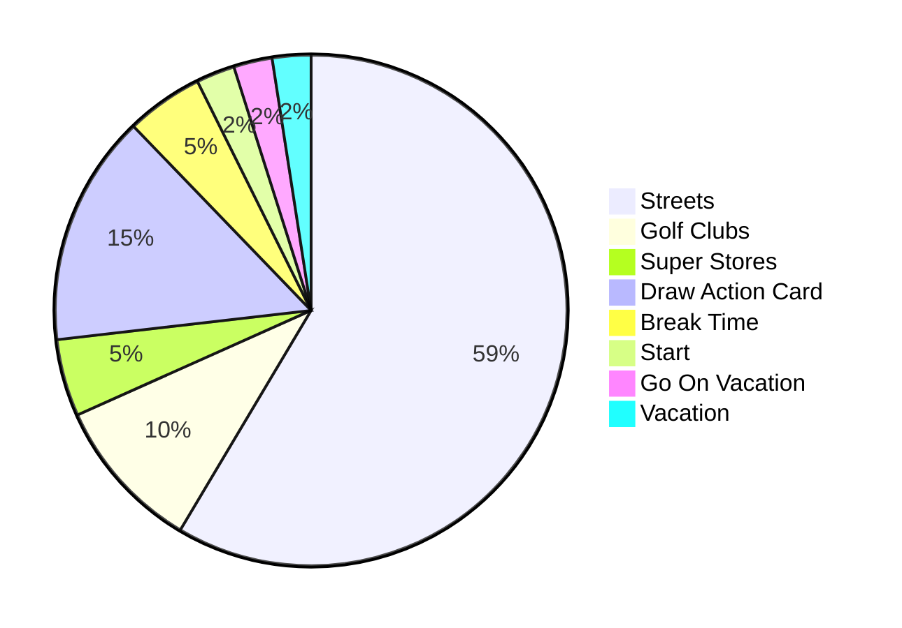
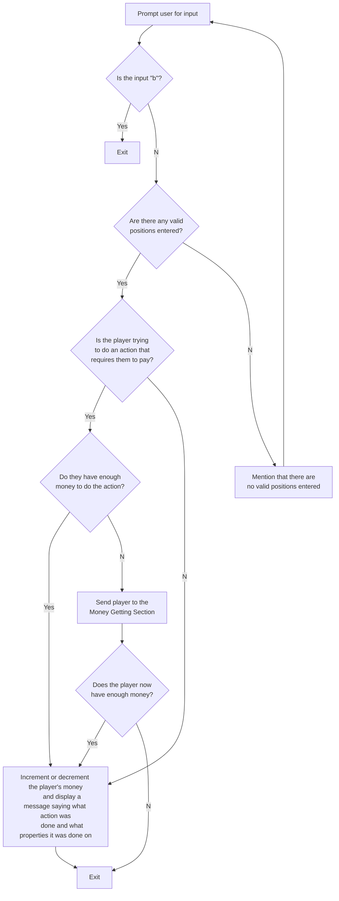
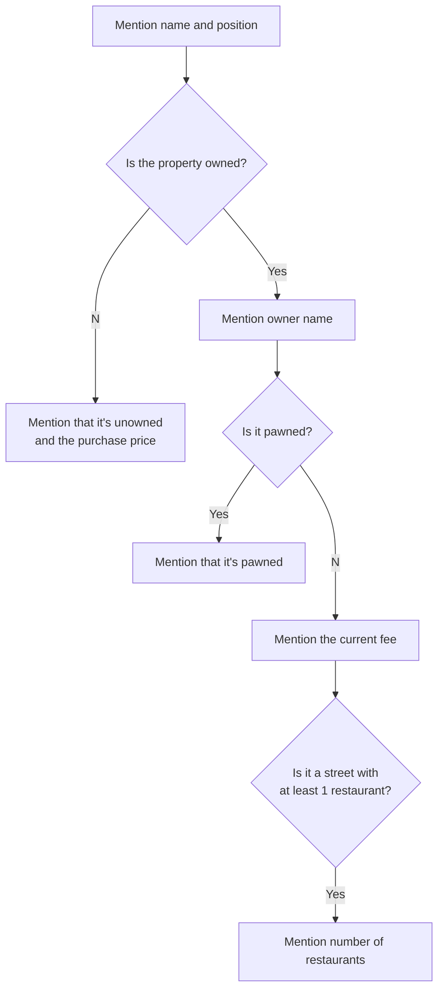
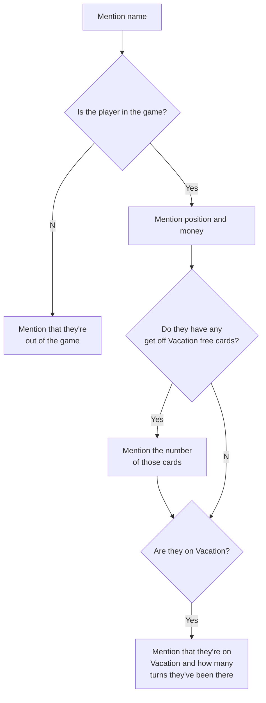

# Singletonopoly
This is a game with a command line interface made using Kotlin and IntelliJ IDEA. All of the Kotlin files in this repo are copies of the 
source files for an IntelliJ IDEA project on my computer.

### History and future of this project
During the spring of 2020, I was thinking that it would be interesting to make coding implementations of some board games. I was also planning
on doing an independent study course over the summer. I came up with the idea of making coding implementations of some board games for the 
independent study course. I proposed my idea to one of my professors who would be a sponsor for the course and they accepted. I decided that
Monopoly would be one of the games I would implement. I decided to make a parody, which in time would be called Singletonopoly. I thought this 
game would be challenging but not overwhelming to implement. I decided to use Kotlin because I had a little experience by using it for an 
Android development course, the professor of which was the professor I proposed my idea to. I was originally planning on first making a command line version of Singletonopoly and then
a graphical user interface version and then do a different board game. However, even after working on a command line version of Singletonopoly for a good portion
of June and all of July, I still was not done with this version. The time period for the independent study course had ended so I turned in all
the source code I had to my professor and then got an A for the course and then got my Bachelor's degree in computer science. I would then 
spend all of August and some of September finishing up this project up and then making minor changes in the following months. 
I might make a graphical user interface version of this project in the future.

### Thoughts on this project
I'm glad I used Kotlin because it has some useful features, some of which I was not familiar with at the start. Some features I like include
smart casting, custom getters, string interpolation, and if statements that are also expressions. I enjoyed this project and 1 reason is because 
this project was a big problem solving exercise and required a bit of thinking to implement all features. Another reason I enjoyed it is because 
all the features were fun to implement because this project is a parody of a board game that I sometimes enjoy playing. The hardest part was 
the trading feature. This part also takes up between 500 and 600 lines of code of the approximately total 2500 lines of code. One problem I 
had with this feature is that I originally made it so that if a player wanted to trade a property with another player, they would only be 
able to trade 1 property per trade. I realized that it would be ideal to let players be able to trade however many properties they want in 
a single trade because what if a player wanted to trade 2 of their properties for 1 of another player's. I had to do some modification to 
allow for this.

## Manual

There's a pie chart :pie: :chart_with_upwards_trend: and some flowcharts in this manual that are generated by the diagramming and charting tool Mermaid :mermaid: and were conveniently able to be added by adding some code to the Markdown. Here's a [*GitHub Docs* article on creating diagrams](https://docs.github.com/en/get-started/writing-on-github/working-with-advanced-formatting/creating-diagrams) and here's the [Mermaid website](https://mermaid.js.org/).

There are also some mathematical expressions in this manual that can be written with GitHub Markdown, such as $p + d \leq 41$. Here's a [*GitHub Docs* article on writing mathematical expressions](https://docs.github.com/en/get-started/writing-on-github/working-with-advanced-formatting/writing-mathematical-expressions).

### Players: 2-8

### Beginning

The game will ask for the number of players and names of those players. Leading and trailing whitespace will be ignored. The names must be unique, meaning that they can’t contain the same characters in the same order. An uppercase letter and the corresponding lowercase letter are different characters. A player can opt to have a default name used for them if they hit Enter without typing anything when they're prompted to enter a name. This default name will be "Player" followed by a number. The names entered or generated here will be displayed throughout the game.

A roll of 2 dice will be generated for each name entered. :game_die: :game_die: Just like standard physical dice, each die rolled here and throughout the game has a minimum value of 1 and a maximum value of 6. The order of the players will be determined by dice rolls in descending order, meaning that higher rolls go first. If there are ties, then the order of the players that tied will be randomized. For example, if 1 player gets a 12, 2 players get a 10, and 1 player gets a 7, then the player that got the 12 will be 1st and the player that got the 7 will be last and the order of the other 2 players will be randomized and one of them will be 2nd and the other will be 3rd.

All players start with :heavy_dollar_sign:4,096 (212) and on position 1 of the board. Along with the amount of money that players start with, there are other references to powers of 2 throughout the game.

### Playing the Game

Throughout the game, the user is prompted to enter input. The valid input options will be shown. These are either a single integer, a group of 1 or more space-separated integers, or short sequences of characters. Like entering the names at the beginning, leading and trailing whitespace is ignored. However, the character sequence inputs are case-insensitive. For example, the input for a player to take their turn is “tt”. Valid inputs for this include but are not limited to “tt”, “ &nbsp; &nbsp; Tt &nbsp; &nbsp; ”, and “TT”.

Before a player takes their turn, they have options to do other things.

Things that can always be done:
- See board spaces
- See property info
- See player info
- Make a trade
- Drop out
- End the game

Things that can conditionally be done if the player has at least 1 property where that action can be done:
- Pawn properties
- Unpawn properties
- Add restaurants to streets
- Remove restaurants from streets

When a player decides to take their turn, 2 dice will be rolled for them. :game_die: :game_die: I'm going to use the variables $p$ to represent the player’s current position and $d$ to represent the sum of the values of the dice. As mentioned in the "The Board" section, there are 41 board spaces. If $p + d \leq 41$, then the player will be placed at position $(p + d)$. If $p + d > 41$, then the player has made a revolution around the board and their new position is equal to the difference between $(p + d)$ and $41$. For example, if $p + d = 42$, then the new position is 1, since the difference between 42 and 41 is 1. After a revolution, a player gains :heavy_dollar_sign:512. The player's new position will be evaluated and appropriate action will be taken. If the values of both dice are the same, also called rolling doubles, that player gets to go again. If a player rolls doubles thrice, or 3 times, in a row, that player will be sent to Vacation.

### The Board

There are 41 spaces:
- 30 Properties
    - 24 Streets
    - 4 Golf Clubs
    - 2 Super Stores
- 6 Draw Action Card
- 2 Break Time
- Start
- Go On Vacation
- Vacation

The Start, Break Time, and Vacation spaces have no effect when landing on them. The effects of the other spaces are described in their section in this manual.

#### All Spaces

The spaces with streets have the street name displayed followed by their neighborhood.
    
| Position | Space                        |
| :------: | ---------------------------- |
|    1     | Start                        |
|    2     | Victoria Street, Vauxhall    |
|    3     | Nottingham Avenue, Vauxhall  |
|    4     | Manchester Road, Vauxhall    |
|    5     | Granby Golf Club             |
|    6     | Luanda Street, Monrovia      |
|    7     | Draw Action Card             |
|    8     | Kinshasa Street, Monrovia    |
|    9     | Lagos Avenue, Monrovia       |
|    10    | Newton Super Store           |
|    11    | Break Time                   |
|    12    | Camden Avenue, Ozark         |
|    13    | Lake Shore Drive, Ozark      |
|    14    | Draw Action Card             |
|    15    | Osage Beach Parkway, Ozark   |
|    16    | Sullivan Avenue, Augusta     |
|    17    | Vacation                     |
|    18    | Labadie Street, Augusta      |
|    19    | Monett Golf Club             |
|    20    | Potosi Street, Augusta       |
|    21    | Ezio Avenue, Little Italy    |
|    22    | Draw Action Card             |
|    23    | Firenze Street, Little Italy |
|    24    | Venezia Street, Little Italy |
|    25    | Neosho Golf Club             |
|    26    | Euler Avenue, Gauss          |
|    27    | Ramanujan Street, Gauss      |
|    28    | Draw Action Card             |
|    29    | Euclid Avenue, Gauss         |
|    30    | Break Time                   |
|    31    | Go On Vacation               |
|    32    | Dijkstra Street, Turing      |
|    33    | Knuth Street, Turing         |
|    34    | Leibniz Super Store          |
|    35    | Draw Action Card             |
|    36    | Ritchie Avenue, Turing       |
|    37    | Chesapeake Avenue, Hampton   |
|    38    | Aurora Golf Club             |
|    39    | Draw Action Card             |
|    40    | Suffolk Avenue, Hampton      |
|    41    | Norfolk Street, Hampton      |
    

### Properties

The 3 types of properties are super stores, golf clubs, and streets. These are all unowned at the beginning. If a player lands on an unowned property then they will have the option to buy it. If they want to buy it but don’t have enough money, they will be sent to the Money Getting Section and if they can gather the money, the property will be given to them. When a player lands on a property that is owned by someone else and unpawned, they will have to pay a fee to the owner. More info about fees are in the property type sections below. If a player can’t pay a fee, they will be sent to the Money Getting Section. If they decide to drop out, their money and properties will go to the player that owned the property.

The names follow themes and these are revealed in the "Name Origins and Pronunciations" section below. Any time info about properties is displayed, the properties will first follow the order of super stores, golf clubs, and streets. The properties in each group will then be ordered by position on the board.

#### Super Stores &nbsp; :department_store:

There are 2 super stores, Newton Super Store and Leibniz Super Store. Each one has a purchase price of :heavy_dollar_sign:512 (29), a pawn price of :heavy_dollar_sign:256 (28), and an unpawn price of :heavy_dollar_sign:282. The fee for a super store is a dice roll multiplied by either 8 or 16, 16 for if the owner of that super store owns the other super store as well and 8 for if they don’t.

#### Golf Clubs &nbsp; :golf: &nbsp; :golfing:

There are 4 golf clubs. The start of the names are "Granby", "Monett", "Neosho", and "Aurora" and the end of each name is "Golf Club". Each one has a purchase price of :heavy_dollar_sign:512 (29), a pawn price of :heavy_dollar_sign:256 (28), and an unpawn price of :heavy_dollar_sign:282. Golf clubs have a fee that depends on how many golf clubs the owner of that golf club owns. The formula is $\frac{512}{2^{4 - n}}$ or $2^{n + 5}$, where $n$ is the number of clubs owned. This gives us the following values:

| Number of Clubs Owned |  Fee  |
| :-------------------: | :---: |
|           1           |  64   |
|           2           |  128  |
|           3           |  256  |
|           4           |  512  |

#### Neighborhoods and Streets :motorway:

There are 24 streets around the board that are grouped into 8 neighborhoods. If you ignore non-street spaces, the streets in a neighborhood are *contiguous*, or next to each other. Here are the streets in the same order that they appear on the board:

| Neighborhood | Street 1          | Street 2          | Street 3            |
| ------------ | ----------------- | ----------------- | ------------------- |
| Vauxhall     | Victoria Street   | Nottingham Avenue | Manchester Road     |
| Monrovia     | Luanda Street     | Kinshasa Street   | Lagos Avenue        |
| Ozark        | Camden Avenue     | Lake Shore Drive  | Osage Beach Parkway |
| Augusta      | Sullivan Avenue   | Labadie Street    | Potosi Street       |
| Little Italy | Ezio Avenue       | Firenze Street    | Venezia Street      |
| Gauss        | Euler Avenue      | Ramanujan Street  | Euclid Avenue       |
| Turing       | Dijkstra Street   | Knuth Street      | Ritchie Avenue      |
| Hampton      | Chesapeake Avenue | Suffolk Avenue    | Norfolk Street      |

Each neighborhood has a number associated with it and these are shown in one of the tables below. The purchase price of a street is its $\text{neighborhood number} \times 128 (2^7)$. The starting fee is the $\text{purchase price} \div 8$. This is what the fee is if the owner owns 1 or 2 of the streets in the corresponding neighborhood. If a player owns all 3 of the streets in a neighborhood, the fees for those streets increase and restaurants can be added to them. There can be a max of 5 restaurants on a street. The price to add a restaurant to a street is half of the purchase price. The money that a player gains when selling a restaurant back is half of the price that was paid to put that restaurant there. For neighborhoods where 1 player owns all streets, the streets have fees that are equal to the $\text{street starting fee} \times (2n + 2)$, where $n$ is the number of restaurants on that street. This gives us the following values:

| Number of Restaurants | Street Starting Fee Multiplier |
| :-------------------: | :----------------------------: |
|           0           |               2                |
|           1           |               4                |
|           2           |               6                |
|           3           |               8                |
|           4           |               10               |
|           5           |               12               |

All of this info, along with some info from the "Pawning" section, gives us the following values. The last 6 columns are for the fees for a street in a neighborhood where 1 player owns all streets. The column headings are for how many restaurants are on that street.

| Neighborhood | Number | Purchase Price | Pawn and Restaurant Add Price | Unpawn Price | Restaurant Removal Price | Starting Fee |   0   |   1   |   2   |   3   |   4   |   5   |
| ------------ | :----: | :------------: | :---------------------------: | :----------: | :----------------------: | :----------: | :---: | :---: | :---: | :---: | :---: | :---: |
| Vauxhall     |   1    |      128       |              64               |     71       |           32             |     16       |  32   |  64   |  96   |  128  |  160  |  192  |
| Monrovia     |   2    |      256       |              128              |     141      |           64             |     32       |  64   |  128  |  192  |  256  |  320  |  384  |
| Ozark        |   3    |      384       |              192              |     212      |           96             |     48       |  96   |  192  |  288  |  384  |  480  |  576  |
| Augusta      |   4    |      512       |              256              |     282      |           128            |     64       |  128  |  256  |  384  |  512  |  640  |  768  |
| Little Italy |   5    |      640       |              320              |     353      |           160            |     80       |  160  |  320  |  480  |  640  |  800  |  960  |
| Gauss        |   6    |      768       |              384              |     423      |           192            |     96       |  192  |  384  |  576  |  768  |  960  | 1,152 |
| Turing       |   7    |      896       |              448              |     494      |           224            |     112      |  224  |  448  |  672  |  896  | 1,120 | 1,344 |
| Hampton      |   8    |     1,024      |              512              |     564      |           256            |     128      |  256  |  512  |  768  | 1,024 | 1,280 | 1,536 |

#### Name Origins and Pronunciations

Many of these have pronunciations that aren’t obvious so I’ll do my best to spell out the pronunciation in parentheses.

- Isaac Newton and Gottfried Leibniz (*got-freed libe-nitz*) are mathematicians who invented and developed calculus.

- Granby, Monett, Neosho, and Aurora are towns along US Route 60 southwest of Springfield, MO. That is a stretch of highway I traveled down a few times during my time living in Springfield and attending Missouri State University.

- The Vauxhall neighborhood is England themed. Vauxhall is a district in London. Victoria is a former British queen. Nottingham and Manchester are cities in England, though Manchester is also a St. Louis suburb and Manchester Road is also a road in the St. Louis area. The British English way of pronouncing Nottingham is *noddingum*.

- Monrovia, Luanda, Kinshasa, and Lagos are cities in Africa. :earth_africa:

- The Ozark neighborhood is Lake of the Ozarks themed. :speedboat: :bikini: :sunrise: :swimming_man: Camden County is where most of the lake and surrounding area is. Lake Shore Drive is a road in Chicago but goes with the theme. Osage Beach is one of the cities at the Lake of the Ozarks and there’s a real road there called Osage Beach Parkway.
    
- Augusta, Sullivan, Labadie, and Potosi are towns in east central Missouri, not far from Union, where I spent much of my life.

- The Little Italy neighborhood is, of course, Italian themed. Ezio Auditore (*et-zee-o ow-de-toray*) is the protagonist in 3 *Assassin’s Creed* games. He’s from Florence in modern-day Italy. I say *modern-day* Italy because the games take place during the 1400s to 1500s and Italy as we know it today didn’t become a country until the 1800s, I think. Speaking of Florence, the Italian name for it is Firenze (*fee-rent-zay*) and the Italian name for Venice is Venezia (*venetzia*).

- Carl Friedrich Gauss (Gauss rhymes with mouse), Leonhard Euler (*lay-o-nard oy-ler*), Srinivasa (similar to *slee-nee-vasa*) Ramanujan, and Euclid (not *oy-clid* but *you-clid*) are mathematicians. Euler is Swiss and Euclid is an ancient Greek which explains the different pronunciations of *eu*. Euclid Avenue is also a street in St. Louis. :fleur_de_lis:

- Alan Turing, Edsger Dijkstra (*dike-struh*), Donald Knuth (*ka-newth*), and Dennis Ritchie are computer scientists.

- Hampton, Chesapeake, Suffolk (*suff-ick*), and Norfolk (*nor-foke*) are cities in the Hampton Roads region of Eastern Virginia.

#### Pawning

Players can pawn their properties to get some money but anybody who lands on a pawned property will not need to pay a fee until that property is unpawned. For all properties, the money that a player gains from pawning is equal to half of that property's purchase price. The money needed to unpawn is calculated by taking the pawn price, adding a 10.24% $(\frac{2^{10}}{100})$ fee, and rounding this to the nearest integer. Streets must have restaurants removed before being able to be pawned.

#### Process for Pawning, Unpawning, and Adding and Removing Restaurants

When a player chooses the option for doing one of these actions, some info is displayed about the properties that can have the action done. The name and position are always mentioned as part of this info. For pawning and unpawning, either the pawn price or unpawn price is also mentioned. For adding and removing restaurants; the number of restaurants, current fee, and either the restaurant adding price or removing price are also mentioned. The player is prompted to enter the positions of the properties they would like to do the action on with each position separated by space or “b” to go back. Non-numeric values or invalid positions entered will be ignored. The process is illustrated by the following flowchart:

#### Seeing Property Info

A player can see property info before they take their turn or during some parts of trading. They can see basic info for their properties, basic info for all properties, or all info for all properties. The info that's mentioned as part of the basic info is illustrated by the following flowchart:

If a player chooses to see all info for all properties, the basic info for each property will be shown along with the pawn and unpawn prices, fees for different situations, and restaurant adding and removing prices for streets. This extra info isn’t unique to any one property so it will be displayed separately from the info that is unique to properties, which is the same info that is illustrated by the flowchart.

If the player sees the info for all properties, there will be headings above each group of properties that say the property type. There will also be neighborhood name headings above each group of streets in a neighborhood. There are also blank lines between each property type group and neighborhood group. If the player sees the info for their properties, there will be no headings nor blank lines.

### Seeing Player Info

A player can see player info before they take their turn or during some parts of trading. The order of the players is the same as the order that was determined at the start of the game. The info that is mentioned about each player is illustrated by the following flowchart:

### Vacation :desert_island: :beach_umbrella:

When a player lands on the "Go On Vacation" space on the board, draws a card from the Action Deck with this same message, or rolls doubles thrice, or 3 times, in a row, that player will be sent to Vacation and their position will be changed to the designated "Vacation" space on the board. The player is stuck on this space for as long as they are on Vacation. On the player's next turn, they will have the choice of either trying to roll doubles, paying :heavy_dollar_sign:128 (27) to get off Vacation, or using a get off Vacation free card if they drew one from the Action Deck or got one from a trade. If they choose to roll doubles and then succeed, the player is off Vacation. A player can be on Vacation for a maximum of 3 turns by choosing to roll doubles each time. After failing to roll doubles for 3 turns in a row, they get off Vacation.

### Action Deck and Action Cards

The Action Deck is a deck of Action Cards with messages on them. When a player lands on a board space that says "Draw Action Card", they draw a card from the Action Deck and do what the card says. The card will then be placed at the bottom of the deck, unless it's a get off Vacation free card. In this case, the card gets removed from the deck and goes to the player that drew it. When a player uses that card, it goes at the bottom of the deck. The deck starts off with 18 cards and is shuffled every game.

Here are the messages of all cards in the deck. The cards that appear twice have "(2x)" after.
- You gain :heavy_dollar_sign:128
- You gain :heavy_dollar_sign:256
- You lose :heavy_dollar_sign:128
- You lose :heavy_dollar_sign:256
- You get :heavy_dollar_sign:32 from every other player
- You must pay every other player :heavy_dollar_sign:32
- You must pay :heavy_dollar_sign:32 per restaurant for maintenance
- You must pay :heavy_dollar_sign:64 per restaurant for maintenance
- Move ahead 4 spaces
- Move ahead 8 spaces
- Move back 4 spaces
- Move back 8 spaces
- Lagos is the most populated city in Africa. Move to Lagos Avenue.
- Computer scientist Donald Knuth once said "Programs are meant to be read by humans and only incidentally for computers to execute". Move to Knuth Street.
- Get off Vacation free. Keep this card and use it when needed, or trade it. (2x)
- Go on Vacation (2x)

#### Remarks

- If a player draws a "You lose :heavy_dollar_sign:x", "You must pay every other player :heavy_dollar_sign:32", or "You must pay :heavy_dollar_sign:x per restaurant for maintenance" card and they don’t have enough money to pay, they will be sent to the Money Getting Section. If they decide to drop out, their properties will become unowned.

- If a player draws the "You get :heavy_dollar_sign:32 from every other player" card and one of those other players doesn’t have enough money to pay, they will be sent to the Money Getting Section. If they decide to drop out, their properties and money will be given to the player that drew the card.

- If a player draws the Lagos Avenue card or Knuth Street card on a Draw Action Card space that is past the location of that street (has a higher position), then that player gets to make a revolution. However, if a player draws a "Go on Vacation" card, the player will be sent to the Vacation space without making a revolution, regardless of which Draw Action Card space they drew the card from.

- If a player lands on the Draw Action Card space at position 7 of the board and draws the "Move back 8 spaces" card, they will get moved to position 40 and will luckily be able to make a revolution and collect :heavy_dollar_sign:512 once they move at least another 2 spaces forward.

### Trading

Players can trade money, properties, and get off Vacation free cards with each other. A player can initiate a trade before they take their turn or if they get sent to the Money Getting Section. They will first be prompted to enter input to either see property info, see player info, cancel the trade, or select a player to trade with. After the initiating player selects a player to trade with, some checks will take place and the trade process will be restarted if any of the following happen:
- The 2 players can’t trade anything besides money.
- The initiating player went to the trading section from the Money Getting Section and selected to trade with a player that doesn’t have money.

The initiating player will first be prompted to choose what they want from the other player and then what they offer. If they don't select anything that they want or don’t offer anything, they will be prompted to either try that part again or cancel the trade. There's no gift-giving in Singletonopoly. :gift: The closest action to this is having a trade where 1 player gives :heavy_dollar_sign:1 and the other player gives any item(s). If the initiating player went to the trading section from the Money Getting Section, they will need to select an amount of money that they want from the other player. If a player decides that they want money or get off Vacation free cards from the other player, they won’t be able to offer that thing when choosing what they offer.

If the initiating player chooses that they want a street that's in a neighborhood owned by the other player or they offer a street that's in a neighborhood that they own and then the trade is confirmed and agreed upon by both players, that neighborhood will no longer be owned by that player and all the restaurants in the neighborhood of that street will be removed and the street fees will go back to the starting fees. A note about this will be displayed below applicable streets when the info about the properties involved in a trade are displayed. If there are restaurants removed, the money for removing those will go to the player who owned them.

After the initiating player chooses what they want and what they offer, all of this will be displayed and then the initiating player will be prompted to confirm, deny, or see property or player info. If they confirm, the other player will then be prompted to accept the trade and then they can accept, deny, or see property or player info. If the trade is accepted, then the necessary changes are made.

### Money Getting Section :heavy_dollar_sign:

When a player needs money, they will be sent here. Sometimes a player is in a situation where they need money and they chose to be in that situation. For example, a player could land on an unowned property and try to buy it without having enough money. Other times, a player needs money and they didn’t choose to be in that situation. For example, a player could land on a property owned by someone else and they don't have enough money to pay the fee.

When a player is at this section, they are given some options. If the player chose to be in their situation, the first option is to exit this section. Otherwise, the first option is to drop out. The second option is to try to make a trade with another player. Other options include pawning properties and removing restaurants from streets but these options are only available if the player has properties where those actions can be done. If the player chooses an option other than the first one and gets enough money to do the thing, they will exit the Money Getting Section and do the thing. If they didn’t get enough money, they will stay in the Money Getting Section and be prompted to do another option.
