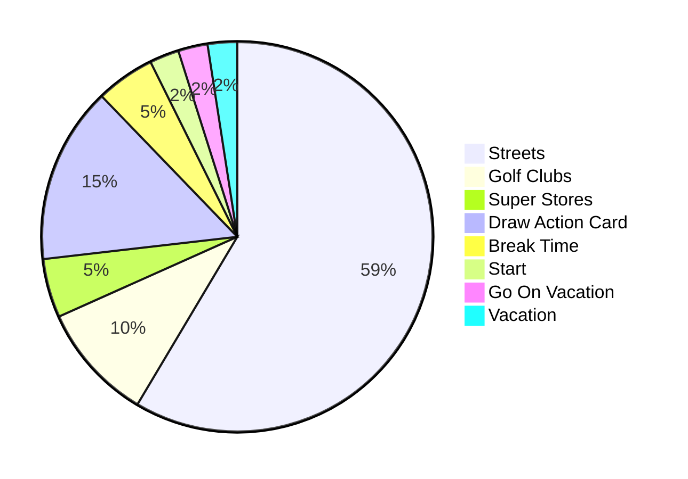
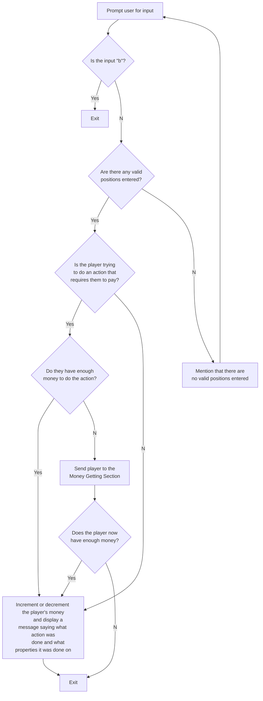
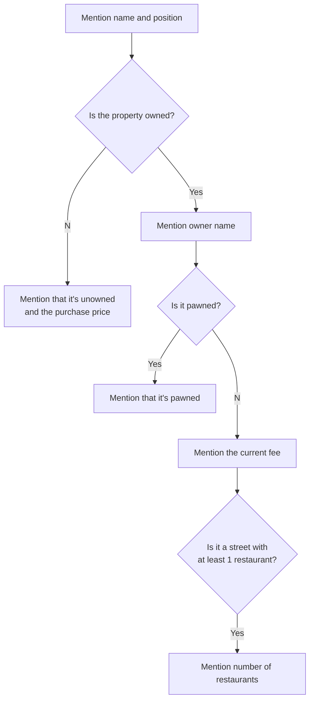
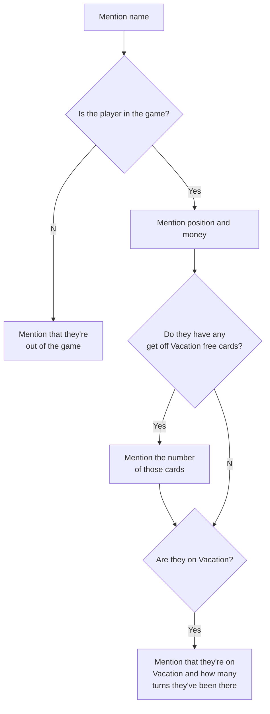

# Singletonopoly

This is a game with a command line interface made using Kotlin. All of the Kotlin files in this repo are copies of the files in an IntelliJ IDEA project of mine. The Game.kt file has the `main` function and the `Game` class, which has most of the code for playing a game. The other Kotlin files have classes, [object declarations (singletons)](https://kotlinlang.org/docs/object-declarations.html#object-declarations-overview), and Misc.kt has functions. Some files have documentation. Some, such as the `PlayerManager` class, seem simple enough that they don't need documentation. Some, such as the `ActionDeck` class, have some code that's explained by some info in the manual.


## Game Objective

Roll some dice, move around a board, and buy some properties. Get money from other players when they land on your properties. :heavy_dollar_sign: :moneybag: :money_with_wings: :money_mouth_face: Remove other players from the game by making them lose all their money and properties. Be the last person remaining in the game. In other words, make the set of players in the game a singleton set that consists of only you.


## Language Used

I did this project with my now-favorite language Kotlin. At the time I started this project, I think my favorite language was Java :coffee:. I decided to use Kotlin because I had a little experience from using it for an Android development course in college. I'm glad I learned it and decided to use it.

Kotlin is statically typed and similar to C# and Java in terms of features, though much of the syntax is different. I think Kotlin is more similar to C#; however, a notable similarity Kotlin has with Java is that Kotlin code can be compiled to Java bytecode! Kotlin code can also be compiled to native binaries or transpiled to front-end JavaScript.

Here's a [Kotlin Docs article that gives a brief overview of syntax and some features of the language and has links to more detailed documentation articles](https://kotlinlang.org/docs/basic-syntax.html). You can also use the menu on the left edge of that page to access other articles. Here's the [Kotlin Standard Library documentation](https://kotlinlang.org/api/latest/jvm/stdlib/). If you go to the page for a class or function in the Standard Library, not only does that page describe the class or function but it also provides a link to the source code. Throughout the rest of the "Language Used" section, including the collapsible section below, I'll give some links to pages in the Kotlin Docs and Standard Library documentation.

I like the features of Kotlin. Some of my favorite ones include [null safety](https://kotlinlang.org/docs/null-safety.html), [lambda features](https://kotlinlang.org/docs/lambdas.html#lambda-expressions-and-anonymous-functions) such as how `it` is the implicit param and the last expression is the return value, [extension functions](https://kotlinlang.org/docs/extensions.html#extension-functions), [destructuring](https://kotlinlang.org/docs/destructuring-declarations.html), and the ability to [name args when calling functions](https://kotlinlang.org/docs/functions.html#named-arguments). I also like the abundance of functions that the Standard Library provides. For example, if you go to [the `Iterable` page](https://kotlinlang.org/api/latest/jvm/stdlib/kotlin.collections/-iterable/), your scrollbar will get really short because of the amount of functions there are.

More info about Kotlin features used in this project is in the collapsible section below.

<details>
<summary>More Info</summary>

#### Destructuring

This is done several times in this project. Any object can be configured to be able to be destructured and several built-in objects are configured this way. The objects that are destructured in this project are [`Map.Entry`](https://kotlinlang.org/api/latest/jvm/stdlib/kotlin.collections/-map/-entry/)s and [`IndexedValue`](https://kotlinlang.org/api/latest/jvm/stdlib/kotlin.collections/-indexed-value/)s. More info about destructuring can be found [here](https://kotlinlang.org/docs/destructuring-declarations.html).

#### Object Declarations (Singletons)

There are several object declarations used, including some companion objects. More info about these can be found [here](https://kotlinlang.org/docs/object-declarations.html#object-declarations-overview).

#### Sealed Classes

The `Property` class is sealed :zipper_mouth_face:. More info about sealed classes can be found [here](https://kotlinlang.org/docs/sealed-classes.html). The 3 subclasses of `Property` are `Street`, `GolfClub`, and `SuperStore`. The benefit to using a sealed class is in the `handleLandingOnProperty` function in the `Game` class. Part of that function is in the collapsible section below.

<details>
<summary>Part of `handleLandingOnProperty`</summary>

```kotlin
fun handleLandingOnProperty(property: Property) {
    ...
    val fee: Int
    when (property) {
        is Street -> {
            fee = ...
            ...
        }
        
        is GolfClub -> {
            ...
            fee = ...
            ...
        }
        
        is SuperStore -> {
            ...
            fee = ...
            ...
        }
    }
    
    // Do some stuff with fee.
}
```

</details>

Using a sealed class allows us to guarantee the compiler that `fee` will be set. If we didn't use a sealed class, we would have to do something such as initialize `fee` with `var fee = 0` instead of `val fee: Int` or have an `else` branch in the `when` statement and throw an exception or set `fee` to something in there.

#### Extension Properties and Functions

In the `Game` class, there are 2 extension properties for `Pair<Int, Int>`s, `bothAreSame` and `sum`. There's also 1 extension function for `Property` `List`s, `filterByPositions`. More info about extension properties and functions can be found [here](https://kotlinlang.org/docs/extensions.html).

#### Lambdas

These are often used in these problems. Info about lambda syntax and features can be found [here](https://kotlinlang.org/docs/lambdas.html#lambda-expressions-and-anonymous-functions).

#### Scope Functions

The functions [`let`](https://kotlinlang.org/api/latest/jvm/stdlib/kotlin/let.html), [`run`](https://kotlinlang.org/api/latest/jvm/stdlib/kotlin/run.html), [`also`](https://kotlinlang.org/api/latest/jvm/stdlib/kotlin/also.html), [`apply`](https://kotlinlang.org/api/latest/jvm/stdlib/kotlin/apply.html), and [`with`](https://kotlinlang.org/api/latest/jvm/stdlib/kotlin/with.html) are known as *scope functions* and these are a special type of higher-order function. `let`, `run`, and `apply` are occasionally used in this project, with `let` being the most frequently used. I used `let` to reduce variable usage; `run` to easily access multiple properties of an object; and `apply` to easily create an object, immediately modify it, and store it to a variable. Examples are shown in the collapsible section below. More info about scope functions can be found [here](https://kotlinlang.org/docs/scope-functions.html).

<details>
<summary>Examples</summary>

##### `let` and `apply`

Both of these functions are used in the initialization of `cardsDeque` at the beginning of the `ActionDeck` class:

```kotlin
private val cardsDeque: ArrayDeque<ActionCard> =
    listOf(
        MoneyGainCard(gainAmount = 128),
        MoneyGainCard(gainAmount = 256),
        MoneyLossCard(lossAmount = 128),
        MoneyLossCard(lossAmount = 256),
        // 14 more ActionCards
    )
    .let { ArrayDeque(elements = it) }
    .apply { shuffle() }
```

First, ***let's*** focus on `let` and ignore `apply`. The use of `let` in the code above is an alternative to using the code in the following 2 code blocks:

```kotlin
private val cardsDeque: ArrayDeque<ActionCard> =
    ArrayDeque(elements =
        listOf(
            MoneyGainCard(gainAmount = 128),
            MoneyGainCard(gainAmount = 256),
            MoneyLossCard(lossAmount = 128),
            MoneyLossCard(lossAmount = 256),
            // 14 more ActionCards
        )
    )
```

```kotlin
private val cardsDeque: ArrayDeque<ActionCard>

init {
    val cards: List<ActionCard> =
        listOf(
            MoneyGainCard(gainAmount = 128),
            MoneyGainCard(gainAmount = 256),
            MoneyLossCard(lossAmount = 128),
            MoneyLossCard(lossAmount = 256),
            // 14 more ActionCards
        )

    cardsDeque = ArrayDeque(elements = cards)
}
```

Now, let's focus on `apply`. The use of that function in the first code block is an alternative to:

```kotlin
private val cardsDeque: ArrayDeque<ActionCard> =
    listOf(
        MoneyGainCard(gainAmount = 128),
        MoneyGainCard(gainAmount = 256),
        MoneyLossCard(lossAmount = 128),
        MoneyLossCard(lossAmount = 256),
        // 14 more ActionCards
    )
    .let { ArrayDeque(elements = it) }

init {
    cardsDeque.shuffle()
}
```

Another use of `let` is to run some code if a value isn't null after using the [safe call operator (`?.`)](https://kotlinlang.org/docs/null-safety.html#safe-calls). For example, the code below is in the `init` function in the `Game` class. `playerManager.winnerName` returns a nullable string, or `String?`.

https://github.com/ncschroeder/Singletonopoly/blob/f7f36ed663e525ec426db4073581b018c850436e/Game.kt#L95-L96

This is an alternative to:

```kotlin
val winnerName: String? = playerManager.winnerName
if (winnerName != null) {
    println("The winner is $winnerName!")
}
```

##### `run`

The beginning of the `rollDiceAndMove` function in the `Game` class is:

https://github.com/ncschroeder/Singletonopoly/blob/f7f36ed663e525ec426db4073581b018c850436e/Game.kt#L333-L335

This is an alternative to:

```kotlin
val diceRoll: Pair<Int, Int> = getDiceRoll()
println("${currentPlayer.name} rolled a ${diceRoll.first} and a ${diceRoll.second}, for a total of ${diceRoll.sum}." )
```

</details>

#### Functions with Receivers

The `run`, `apply`, and `with` scope functions have a param named `block` and the type of it is `T.() -> Unit`, where `T` is a type param. The [`buildList`](https://kotlinlang.org/api/latest/jvm/stdlib/kotlin.collections/build-list.html) function has a param named `builderAction` and the type of it is `MutableList<E>.() -> Unit`, where `E` is a type param. These types are functions with a receiver and the receiver type is the type before the `.()`. This type of function can be created with a lambda and inside that lambda, you can access members of the receiver type without needing an instance of that type. For example, a usage of `buildList` in the `GolfClub` class can be seen in the collapsible section below.

<details>
<summary>`buildList` Usage</summary>

https://github.com/ncschroeder/Singletonopoly/blob/f7f36ed663e525ec426db4073581b018c850436e/GolfClub.kt#L56-L67

`add` is a [`MutableList`](https://kotlinlang.org/api/latest/jvm/stdlib/kotlin.collections/-mutable-list/) function that would otherwise be called like `someMutableList.add(...)`.

</details>

`buildList` is also used in the `Neighborhood` and `PropertyManager` classes.

More info about functions with receivers can be found [here](https://kotlinlang.org/docs/lambdas.html#function-types) and [here](https://kotlinlang.org/docs/lambdas.html#function-literals-with-receiver).

#### Eager and Lazy Collection Operations

Some collection operations, such as mapping and filtering, can be either eagerly or lazily evaluated. If one of those operations is performed on an [`Iterable`](https://kotlinlang.org/api/latest/jvm/stdlib/kotlin.collections/-iterable/), [`Array`](https://kotlinlang.org/api/latest/jvm/stdlib/kotlin/-array/), [`String`](https://kotlinlang.org/api/latest/jvm/stdlib/kotlin/-string/), [`CharSequence`](https://kotlinlang.org/api/latest/jvm/stdlib/kotlin/-char-sequence/), or [`Map`](https://kotlinlang.org/api/latest/jvm/stdlib/kotlin.collections/-map/); it'll be eagerly evaluated and if performed on a [`Sequence`](https://kotlinlang.org/api/latest/jvm/stdlib/kotlin.sequences/-sequence/), it'll be lazily evaluated. `Iterable` and `Sequence` are interfaces that have a type param `T` and require an implementation of `operator fun iterator(): Iterator<T>`. The same operations can be performed on iterables and sequences and many of those operations can also be performed on arrays, strings, char sequences, and maps. `Iterable` is the interface that types such as [`List`](https://kotlinlang.org/api/latest/jvm/stdlib/kotlin.collections/-list/), [`Set`](https://kotlinlang.org/api/latest/jvm/stdlib/kotlin.collections/-set/), and [`IntRange`](https://kotlinlang.org/api/latest/jvm/stdlib/kotlin.ranges/-int-range/) implement. As implied a few sentences ago; arrays, strings, char sequences, and maps aren't iterables. An iterable, array, string, char sequence, or map can be converted to a sequence by using the [`asSequence`](https://kotlinlang.org/api/latest/jvm/stdlib/kotlin.collections/as-sequence.html) function, though there are a few other ways to create a sequence.

Here's [an article that mostly goes over sequences and lazy evaluation but also goes over iterables and eager evaluation](https://kotlinlang.org/docs/sequences.html).

A good question is: when should eager evaluation be used and when should lazy evaluation be used? There's not a clear answer to that. The 4<sup>th</sup> paragraph of the article linked above gives some info about that. Here's that paragraph:

> So, the sequences let you avoid building results of intermediate steps, therefore improving the performance of the whole collection processing chain. However, the lazy nature of sequences adds some overhead which may be significant when processing smaller collections or doing simpler computations. Hence, you should consider both `Sequence` and `Iterable` and decide which one is better for your case.

In this project, there are several times when collection multi-step processing is done but the amount of elements involved in the intermediate steps is small. For this reason, I decided to do that processing with iterables, arrays, strings, and maps; which results in eager evaluation and intermediate collections. Some examples are shown in the collapsible section below.

<details>
<summary>Collection Multi-Step Processing Examples</summary>

##### Example 1

Here's the `getPropertiesOwnedBy` function in the `PropertyManager` object:

https://github.com/ncschroeder/Singletonopoly/blob/f7f36ed663e525ec426db4073581b018c850436e/PropertyManager.kt#L24-L25

The list returned by this will contain at most 30 elements and is used as an intermediate collection half the time. Here's some code in the `Game` class for finding the number of restaurants a player owns:

```kotlin
fun handleLandingOnDrawActionCard() {
    val topCard: ActionCard = actionDeck.topCard
    ...     
    when (topCard) {
        ...
        is PropertyMaintenanceCard -> {
            val numRestaurantsOwned: Int =
                PropertyManager.getPropertiesOwnedBy(currentPlayer)
                .filterIsInstance<Street>()
                .sumOf { it.numRestaurants }
            ...
        }
        ...
    }
}
```

`filterIsInstance<Street>()` returns another list, which will contain at most 24 elements and is another intermediate collection. If I decided to use sequences, I would have `getPropertiesOwnedBy` return a sequence with `allProperties.asSequence().filter { it.owner == player }`. Then, when finding the number of restaurants a player owns, `filterIsInstance<Street>()` would return a sequence.

##### Example 2

Here's the `filterByPositions` extension function in the `Game` class:

https://github.com/ncschroeder/Singletonopoly/blob/f7f36ed663e525ec426db4073581b018c850436e/Game.kt#L883-L897

In the code above, `split` and `mapNotNull` return lists. If I decided to use sequences, I would use:

```kotlin
val inputInts: Set<Int> =
    positionsInput
    .splitToSequence(Regex(" +"))
    .mapNotNull { it.toIntOrNull() }
    .toSet()
```

In the code above, `splitToSequence` and `mapNotNull` return sequences.

</details>

</details>

## Project History

<details>

During the spring of 2020, I thought it would be interesting to make computerized versions of some board games. I was also planning on doing an independent study course over the summer. I came up with the idea of making computerized versions of some board games for the independent study course. I proposed my idea to one of my professors who would be a sponsor for the course and they accepted. I decided that Monopoly would be one of the games I would implement. I decided to make a parody, which in time would be called Singletonopoly. I thought this game would be challenging but not overwhelming to implement. I decided to use Kotlin because I had a little experience by using it for an Android development course, the professor of which was the professor I proposed my idea to.

I started the work in June 2020. The independent study course came to an end at the end of July. By that time, I wasn't done but submitted my work to the professor and then got an A for the course and got my Bachelor's degree in Computer Science. :man_student: I spent more time to finish the project and got a finished version uploaded to GitHub in October. Refactoring was done and other changes were made throughout 2021, 2022, and 2023.

One part of the project that got changed significantly was the manual. This started off having 10 sections, ~1,200 words, and no lists, tables, flowcharts, pie charts, nor emojis. :slightly_smiling_face: I was able to come up with a lot more stuff that could be added to the manual and now, as mentioned in the "Manual" section, it has 15 sections, ~4,200 words, 7 lists, 5 tables, 3 flowcharts, 1 pie chart, and ~40 emojis.

### Refactoring Examples

#### Higher-Order Functions

In early versions of this project, something that I didn't use very much are higher-order functions. Some examples are in the `PlayerManager` class. Here's some old code for finding the count of players that are in the game:

https://github.com/ncschroeder/Singletonopoly/blob/19bbbdd34e26252db5399f8cca1456611c915755/PlayerManager.kt#L138-L147

In the current version, that count is found using `players.count { it.isInGame }`.

Here's some old code for building a string that contains info about players:

https://github.com/ncschroeder/Singletonopoly/blob/e5c09b1f3ce4883acd655f0636b6247a3b49c253/PlayerManager.kt#L142-L148

Here's the current implementation:

https://github.com/ncschroeder/Singletonopoly/blob/5698b1b60623068af849a7a02126efa571dba267/PlayerManager.kt#L22-L23

#### Enums

Another problem with early versions of this project was an inappropriate use of string literals. Namely, the non-property spaces that are now implemented as the `NonPropertySpace` enum used to be implemented with string literals. String literals were used by the `boardSpaces` array in the `Board` class like this: 

```kotlin
private val boardSpaces = arrayOf(
    "Start",
    ...
    "Draw Action Card",
    ...
    "Break Time",
    ...
)
```

As a result of that, the `getBoardSpace` function would possibly return those strings and then the `evaluatePosition` function in the `Game` class would have to use string literals to check a result, as seen in this code snippet:

https://github.com/ncschroeder/Singletonopoly/blob/19bbbdd34e26252db5399f8cca1456611c915755/Game.kt#L370-L385

This is bad because of the possibility of typos. Since an enum is used now, typos aren't a problem since there'll be a compilation error if you misspell the name of an enum or one of its constants. Though, you don't even have to type out the enum or constant name. You can just start typing the enum name and then your IDE should display an autocomplete option with that name. You can select this and type a `.` and then your IDE should display autocomplete options with the enum constant names and you can select one.

The `Board` object now has a `spacesMap` and the values of that map come from the elements of an array and some of these elements are instances of the `NonPropertySpace` enum like this:

```kotlin
private val spacesMap: Map<Int, Any> =
    arrayOf(
        NonPropertySpace.START,
        ...
        NonPropertySpace.DRAW_ACTION_CARD,
        ...
        NonPropertySpace.BREAK_TIME,
        ...
    )
    ...
```

As a result of this, the `getSpace` function will possibly return a `NonPropertySpace` and then the `evaluatePosition` function can easily check if an instance of that got returned and which instance got returned, as seen in this code snippet:

https://github.com/ncschroeder/Singletonopoly/blob/5698b1b60623068af849a7a02126efa571dba267/Game.kt#L372-L388

</details>


## Manual

This manual has a lot of info about the game but virtually no info about the implementation of it. There's 15 sections, ~4,200 words, 7 lists, 5 tables, 3 flowcharts, 1 pie chart :pie: :chart_with_upwards_trend:, and ~40 emojis. :slightly_smiling_face:

The flowcharts and pie chart are generated by the diagramming and charting tool Mermaid :mermaid: and were conveniently able to be added by adding some code to the Markdown. Here's a [*GitHub Docs* article on creating diagrams](https://docs.github.com/en/get-started/writing-on-github/working-with-advanced-formatting/creating-diagrams) and here's the [Mermaid website](https://mermaid.js.org/).

There are also some mathematical expressions in this manual that can be written with GitHub Markdown, such as $p + d \leq 41$. Here's a [*GitHub Docs* article on writing mathematical expressions](https://docs.github.com/en/get-started/writing-on-github/working-with-advanced-formatting/writing-mathematical-expressions).

### Players: 2-8

### Beginning

The game will ask for the number of players and names of those players. Leading and trailing whitespace will be ignored. The names must be unique, meaning that they can’t contain the same characters in the same order. An uppercase letter and the corresponding lowercase letter are different characters. A player can opt to have a default name used for them if they hit Enter without typing anything when they're prompted to enter a name. This default name will be "Player" followed by a number. The names entered or generated here will be displayed throughout the game.

A roll of 2 dice will be generated for each name entered. :game_die: :game_die: Just like standard physical dice, each die rolled here and throughout the game has a minimum value of 1 and a maximum value of 6. The order of the players will be determined by dice rolls in descending order, meaning that higher rolls go first. If there are ties, then the order of the players that tied will be randomized. For example, if 1 player gets a 12, 2 players get a 10, and 1 player gets a 7, then the player that got the 12 will be 1st and the player that got the 7 will be last and the order of the other 2 players will be randomized and one of them will be 2nd and the other will be 3rd.

All players start with :heavy_dollar_sign:4,096 (2<sup>12</sup>) and on position 1 of the board. Along with the amount of money that players start with, there are other references to powers of 2 throughout the game.


### Playing the Game

Throughout the game, the user is prompted to enter input. The valid input options will be shown. These are either a single integer, a group of 1 or more space-separated integers, or short sequences of characters. Like entering the names at the beginning, leading and trailing whitespace is ignored. However, the character sequence inputs are case-***in***sensitive. For example, the input for a player to take their turn is “tt”. Valid inputs for this include but are not limited to “tt”, “ &nbsp; &nbsp; Tt &nbsp; &nbsp; ”, and “TT”. If invalid input is entered, the text "Invalid input" will be displayed and new input will need to be entered.

Before a player takes their turn, they have options to do other things.

Things that can always be done:
- See board spaces
- See property info
- See player info
- Make a trade
- Drop out
- End the game

Things that can conditionally be done if the player has at least 1 property where that action can be done:
- Pawn properties
- Unpawn properties
- Add restaurants to streets
- Remove restaurants from streets

When a player decides to take their turn, 2 dice will be rolled for them. :game_die: :game_die: I'm going to use the variables $p$ to represent the player’s current position and $d$ to represent the sum of the values of the dice. As mentioned in the "The Board" section, there are 41 board spaces. If $p + d \leq 41$, then the player will be placed at position $(p + d)$. If $p + d > 41$, then the player has made a revolution around the board and their new position is equal to the difference between $(p + d)$ and $41$. For example, if $p + d = 42$, then the new position is 1, since the difference between 42 and 41 is 1. After a revolution, a player gains :heavy_dollar_sign:512. The player's new position will be evaluated and appropriate action will be taken. If the values of both dice are the same, also called rolling doubles, that player gets to go again. If a player rolls doubles thrice, or 3 times, in a row, that player will be sent to Vacation.


### The Board

There are 41 spaces:
- 30 Properties
    - 24 Streets
    - 4 Golf Clubs
    - 2 Super Stores
- 6 Draw Action Card
- 2 Break Time
- Start
- Go On Vacation
- Vacation

Here's a pie chart that displays the percentages of each type of space:



The Start, Break Time, and Vacation spaces have no effect when landing on them. The effects of the other spaces are described in their section in this manual.

Here are all the spaces on the board. The spaces with streets have the street name displayed followed by their neighborhood.
    
| Position | Space                        |
| :------: | ---------------------------- |
|    1     | Start                        |
|    2     | Victoria Street, Vauxhall    |
|    3     | Nottingham Avenue, Vauxhall  |
|    4     | Manchester Road, Vauxhall    |
|    5     | Granby Golf Club             |
|    6     | Luanda Street, Monrovia      |
|    7     | Draw Action Card             |
|    8     | Kinshasa Street, Monrovia    |
|    9     | Lagos Avenue, Monrovia       |
|    10    | Newton Super Store           |
|    11    | Break Time                   |
|    12    | Camden Avenue, Ozark         |
|    13    | Lake Shore Drive, Ozark      |
|    14    | Draw Action Card             |
|    15    | Osage Beach Parkway, Ozark   |
|    16    | Sullivan Avenue, Augusta     |
|    17    | Vacation                     |
|    18    | Labadie Street, Augusta      |
|    19    | Monett Golf Club             |
|    20    | Potosi Street, Augusta       |
|    21    | Ezio Avenue, Little Italy    |
|    22    | Draw Action Card             |
|    23    | Firenze Street, Little Italy |
|    24    | Venezia Street, Little Italy |
|    25    | Neosho Golf Club             |
|    26    | Euler Avenue, Gauss          |
|    27    | Ramanujan Street, Gauss      |
|    28    | Draw Action Card             |
|    29    | Euclid Avenue, Gauss         |
|    30    | Break Time                   |
|    31    | Go On Vacation               |
|    32    | Dijkstra Street, Turing      |
|    33    | Knuth Street, Turing         |
|    34    | Leibniz Super Store          |
|    35    | Draw Action Card             |
|    36    | Ritchie Avenue, Turing       |
|    37    | Chesapeake Avenue, Hampton   |
|    38    | Aurora Golf Club             |
|    39    | Draw Action Card             |
|    40    | Suffolk Avenue, Hampton      |
|    41    | Norfolk Street, Hampton      |
    

### Properties

The 3 types of properties are super stores, golf clubs, and streets. There are subsections below that give more info about these. All properties are unowned at the beginning. If a player lands on an unowned property then they will have the option to buy it. If they want to buy it but don’t have enough money, they will be sent to the Money Getting Section and if they can gather the money, the property will be given to them. When a player lands on a property that is owned by someone else and unpawned, they will have to pay a fee to the owner. If a player can’t pay a fee, they will be sent to the Money Getting Section. If they decide to drop out, their money and properties will go to the player that owned the property.

The property names follow themes and these are revealed in the "Name Origins" collapsible sections in the property type subsections below. Any time info about properties is displayed, the properties will first follow the order of super stores, golf clubs, and streets. The properties in each group will then be ordered by position on the board.


#### Super Stores &nbsp; :department_store:

There are 2 super stores, Newton Super Store and Leibniz Super Store. Each one has a purchase price of :heavy_dollar_sign:512 (2<sup>9</sup>), a pawn price of :heavy_dollar_sign:256 (2<sup>8</sup>), and an unpawn price of :heavy_dollar_sign:282. The fee for a super store is a dice roll multiplied by either 8 or 16, 16 for if the owner of that super store owns the other super store as well and 8 for if they don’t.

<details>
<summary>Name Origins</summary>

[Isaac Newton](https://en.wikipedia.org/wiki/Isaac_Newton) and [Gottfried Leibniz](https://en.wikipedia.org/wiki/Gottfried_Wilhelm_Leibniz) were mathematicians who invented and developed calculus.

</details>

#### Golf Clubs &nbsp; :golf: &nbsp; :golfing:

There are 4 golf clubs. The start of the names are "Granby", "Monett", "Neosho", and "Aurora" and the end of each name is "Golf Club". Each one has a purchase price of :heavy_dollar_sign:512 (2<sup>9</sup>), a pawn price of :heavy_dollar_sign:256 (2<sup>8</sup>), and an unpawn price of :heavy_dollar_sign:282. Golf clubs have a fee that depends on how many golf clubs the owner of that golf club owns. The formula is $\frac{512}{2^{4 - n}}$ or $2^{n + 5}$, where $n$ is the number of clubs owned. This gives us the following values:

| Number of Clubs Owned |  Fee  |
| :-------------------: | :---: |
|           1           |  64   |
|           2           |  128  |
|           3           |  256  |
|           4           |  512  |

<details>
<summary>Name Origins</summary>

[Granby](https://en.wikipedia.org/wiki/Granby,_Missouri), [Monett](https://en.wikipedia.org/wiki/Monett,_Missouri), [Neosho](https://en.wikipedia.org/wiki/Neosho,_Missouri), and [Aurora](https://en.wikipedia.org/wiki/Aurora,_Missouri) are Missouri towns along [US Route 60](https://en.wikipedia.org/wiki/U.S._Route_60_in_Missouri) southwest of [Springfield](https://en.wikipedia.org/wiki/Springfield,_Missouri). That's a route I traveled on a few times during my time living in Springfield and attending Missouri State University.


</details>


#### Neighborhoods and Streets :motorway:

There are 24 streets around the board that are grouped into 8 neighborhoods. If you ignore non-street spaces, the streets in a neighborhood are *contiguous*, or next to each other. Here are the streets in the same order that they appear on the board:

| Neighborhood | Street 1          | Street 2          | Street 3            |
| ------------ | ----------------- | ----------------- | ------------------- |
| Vauxhall     | Victoria Street   | Nottingham Avenue | Manchester Road     |
| Monrovia     | Luanda Street     | Kinshasa Street   | Lagos Avenue        |
| Ozark        | Camden Avenue     | Lake Shore Drive  | Osage Beach Parkway |
| Augusta      | Sullivan Avenue   | Labadie Street    | Potosi Street       |
| Little Italy | Ezio Avenue       | Firenze Street    | Venezia Street      |
| Gauss        | Euler Avenue      | Ramanujan Street  | Euclid Avenue       |
| Turing       | Dijkstra Street   | Knuth Street      | Ritchie Avenue      |
| Hampton      | Chesapeake Avenue | Suffolk Avenue    | Norfolk Street      |

<details>
<summary>Name Origins</summary>

- The Vauxhall neighborhood is England themed. Vauxhall is a [district in London](https://en.wikipedia.org/wiki/Vauxhall) and an [English car company](https://en.wikipedia.org/wiki/Vauxhall_Motors). [Victoria](https://en.wikipedia.org/wiki/Queen_Victoria) was a British queen. [Nottingham](https://en.wikipedia.org/wiki/Nottingham) and [Manchester](https://en.wikipedia.org/wiki/Manchester) are cities in England, though Manchester is also a St. Louis suburb and Manchester Road is also a road in the St. Louis area.

In the map below, the red dots form the outline of Vauxhall.


- [Monrovia, Liberia](https://en.wikipedia.org/wiki/Monrovia), [Luanda, Angola](https://en.wikipedia.org/wiki/Luanda), [Kinshasa, Democratic Republic of the Congo](https://en.wikipedia.org/wiki/Kinshasa), and [Lagos, Nigeria](https://en.wikipedia.org/wiki/Lagos) are cities in Africa. :earth_africa: Fun fact: Monrovia was named after 6<sup>th</sup> U.S. president James Monroe.


- The Ozark neighborhood is [Lake of the Ozarks](https://en.wikipedia.org/wiki/Lake_of_the_Ozarks) themed. :speedboat: :bikini: :sunrise: :swimming_man: [Camden County](https://en.wikipedia.org/wiki/Camden_County,_Missouri) is where most of the lake and surrounding area is. [Lake Shore Drive](https://en.wikipedia.org/wiki/Lake_Shore_Drive) is a road in Chicago but goes with the theme. [Osage Beach](https://en.wikipedia.org/wiki/Osage_Beach,_Missouri) is a city by the lake and there’s a road there called Osage Beach Parkway.

In the map below, the red dots form the outline of Camden County.


    
- [Augusta](https://en.wikipedia.org/wiki/Augusta,_Missouri), [Sullivan](https://en.wikipedia.org/wiki/Sullivan,_Missouri), [Labadie](https://en.wikipedia.org/wiki/Labadie,_Missouri), and [Potosi](https://en.wikipedia.org/wiki/Potosi,_Missouri) are towns in east central Missouri, not far from [Union](https://en.wikipedia.org/wiki/Union,_Missouri), where I spent much of my life.


- The Little Italy neighborhood is, of course, Italian themed. [Ezio Auditore da Firenze](https://en.wikipedia.org/wiki/Ezio_Auditore_da_Firenze) is the protagonist in 3 [*Assassin’s Creed*](https://en.wikipedia.org/wiki/Assassin%27s_Creed) games and is from Florence. [Florence](https://en.wikipedia.org/wiki/Florence) and [Venice](https://en.wikipedia.org/wiki/Venice) are cities in modern-day Italy and the Italian names for them are Firenze and Venezia, respectively.


- [Carl Friedrich Gauss](https://en.wikipedia.org/wiki/Carl_Friedrich_Gauss), [Leonhard Euler](https://en.wikipedia.org/wiki/Leonhard_Euler), [Srinivasa Ramanujan](https://en.wikipedia.org/wiki/Srinivasa_Ramanujan), and [Euclid](https://en.wikipedia.org/wiki/Euclid) are mathematicians. Euclid Avenue is also a street in St. Louis. :fleur_de_lis:

- [Alan Turing](https://en.wikipedia.org/wiki/Alan_Turing), [Edsger Dijkstra](https://en.wikipedia.org/wiki/Edsger_W._Dijkstra), [Donald Knuth](https://en.wikipedia.org/wiki/Donald_Knuth), and [Dennis Ritchie](https://en.wikipedia.org/wiki/Dennis_Ritchie) are computer scientists.

- [Hampton](https://en.wikipedia.org/wiki/Hampton,_Virginia), [Chesapeake](https://en.wikipedia.org/wiki/Chesapeake,_Virginia), [Suffolk](https://en.wikipedia.org/wiki/Suffolk,_Virginia), and [Norfolk](https://en.wikipedia.org/wiki/Norfolk,_Virginia) are cities in the [Hampton Roads region of eastern Virginia](https://en.wikipedia.org/wiki/Hampton_Roads).


</details>

<details>
<summary>Implementation Note</summary>

This table looks similar to the `Neighborhood` enum constant declarations, as seen in this code snippet:

https://github.com/ncschroeder/Singletonopoly/blob/5698b1b60623068af849a7a02126efa571dba267/Neighborhood.kt#L15-L23

</details>

Each neighborhood has a number associated with it and these are shown in one of the tables below. The purchase price of a street is its $\text{neighborhood number} \times 128 (2^7)$. The starting fee is the $\text{purchase price} \div 8$. This is what the fee is if the owner owns 1 or 2 of the streets in the corresponding neighborhood. If a player owns all 3 of the streets in a neighborhood, the fees for those streets increase and restaurants can be added to them. There can be a max of 5 restaurants on a street. The price to add a restaurant to a street is half of the purchase price. The money that a player gains when selling a restaurant back is half of the price that was paid to put that restaurant there. For neighborhoods where 1 player owns all streets, the streets have fees that are equal to the $\text{street starting fee} \times (2n + 2)$, where $n$ is the number of restaurants on that street. This gives us the following values:

| Number of Restaurants | Street Starting Fee Multiplier |
| :-------------------: | :----------------------------: |
|           0           |               2                |
|           1           |               4                |
|           2           |               6                |
|           3           |               8                |
|           4           |               10               |
|           5           |               12               |

All of this info, along with some info from the "Pawning" section, gives us the following values. The last 6 columns are for the fees for a street in a neighborhood where 1 player owns all streets. The column headings are for how many restaurants are on that street.

| Neighborhood | Number | Purchase Price | Pawn and Restaurant Add Price | Unpawn Price | Restaurant Removal Price | Starting Fee |   0   |   1   |   2   |   3   |   4   |   5   |
| ------------ | :----: | :------------: | :---------------------------: | :----------: | :----------------------: | :----------: | :---: | :---: | :---: | :---: | :---: | :---: |
| Vauxhall     |   1    |      128       |              64               |     71       |           32             |     16       |  32   |  64   |  96   |  128  |  160  |  192  |
| Monrovia     |   2    |      256       |              128              |     141      |           64             |     32       |  64   |  128  |  192  |  256  |  320  |  384  |
| Ozark        |   3    |      384       |              192              |     212      |           96             |     48       |  96   |  192  |  288  |  384  |  480  |  576  |
| Augusta      |   4    |      512       |              256              |     282      |           128            |     64       |  128  |  256  |  384  |  512  |  640  |  768  |
| Little Italy |   5    |      640       |              320              |     353      |           160            |     80       |  160  |  320  |  480  |  640  |  800  |  960  |
| Gauss        |   6    |      768       |              384              |     423      |           192            |     96       |  192  |  384  |  576  |  768  |  960  | 1,152 |
| Turing       |   7    |      896       |              448              |     494      |           224            |     112      |  224  |  448  |  672  |  896  | 1,120 | 1,344 |
| Hampton      |   8    |     1,024      |              512              |     564      |           256            |     128      |  256  |  512  |  768  | 1,024 | 1,280 | 1,536 |


#### Pawning

Players can pawn their properties to get some money but anybody who lands on a pawned property will not need to pay a fee until that property is unpawned. For all properties, the money that a player gains from pawning is equal to half of that property's purchase price. The money needed to unpawn is calculated by taking the pawn price, adding a 10.24% $(\frac{2^{10}}{100})$ fee, and rounding this to the nearest integer. Streets must have restaurants removed before being able to be pawned.


#### Process for Pawning, Unpawning, and Adding and Removing Restaurants

When a player chooses the option for doing one of these actions, some info is displayed about the properties that can have the action done. The name and position are always mentioned as part of this info. For pawning and unpawning, either the pawn price or unpawn price is also mentioned. For adding and removing restaurants; the number of restaurants, current fee, and either the restaurant adding price or removing price are also mentioned. The player is prompted to enter the positions of the properties they would like to do the action on with each position separated by space or “b” to go back. Non-numeric values or invalid positions entered will be ignored. The process is illustrated by the following flowchart:




#### Seeing Property Info

A player can see property info before they take their turn or during some parts of trading. They can see basic info for their properties, basic info for all properties, or all info for all properties. The info that's mentioned as part of the basic info is illustrated by the following flowchart:



If a player chooses to see all info for all properties, the basic info for each property will be shown along with the pawn and unpawn prices, fees for different situations, and restaurant adding and removing prices for streets. This extra info isn’t unique to any one property so it will be displayed separately from the info that is unique to properties, which is the same info that is illustrated by the flowchart.

If the player sees the info for all properties, there will be headings above each group of properties that say the property type. There will also be neighborhood name headings above each group of streets in a neighborhood. There are also blank lines between each property type group and neighborhood group. If the player sees the info for their properties, there will be no headings nor blank lines.


### Seeing Player Info

A player can see player info before they take their turn or during some parts of trading. The order of the players is the same as the order that was determined at the start of the game. The info that is mentioned about each player is illustrated by the following flowchart:




### Vacation :desert_island: :beach_umbrella:

When a player lands on the "Go On Vacation" space on the board, draws a card from the Action Deck with this same message, or rolls doubles thrice, or 3 times, in a row, that player will be sent to Vacation and their position will be changed to the designated "Vacation" space on the board. The player is stuck on this space for as long as they are on Vacation. On the player's next turn, they will have the choice of either trying to roll doubles, paying :heavy_dollar_sign:128 (2<sup>7</sup>) to get off Vacation, or using a get off Vacation free card if they drew one from the Action Deck or got one from a trade. If they choose to roll doubles and then succeed, the player is off Vacation. A player can be on Vacation for a maximum of 3 turns by choosing to roll doubles each time. After failing to roll doubles for 3 turns in a row, they get off Vacation.


### Action Deck and Action Cards

The Action Deck is a deck of Action Cards with messages on them. When a player lands on a board space that says "Draw Action Card", they draw a card from the Action Deck and do what the card says. The card will then be placed at the bottom of the deck, unless it's a get off Vacation free card. In this case, the card gets removed from the deck and goes to the player that drew it. When a player uses that card, it goes at the bottom of the deck. The deck starts off with 18 cards and is shuffled every game.

Here are the messages of all cards in the deck. The cards that appear twice have "(2x)" after.
- You gain :heavy_dollar_sign:128
- You gain :heavy_dollar_sign:256
- You lose :heavy_dollar_sign:128
- You lose :heavy_dollar_sign:256
- You get :heavy_dollar_sign:32 from every other player
- You must pay every other player :heavy_dollar_sign:32
- You must pay :heavy_dollar_sign:32 per restaurant for maintenance
- You must pay :heavy_dollar_sign:64 per restaurant for maintenance
- Move ahead 4 spaces
- Move ahead 8 spaces
- Move back 4 spaces
- Move back 8 spaces
- Lagos is the most populated city in Africa. Move to Lagos Avenue.
- Computer scientist Donald Knuth once said "Programs are meant to be read by humans and only incidentally for computers to execute". Move to Knuth Street.
- Get off Vacation free. Keep this card and use it when needed, or trade it. (2x)
- Go on Vacation (2x)

#### Remarks

- If a player draws a "You lose :heavy_dollar_sign:x", "You must pay every other player :heavy_dollar_sign:32", or "You must pay :heavy_dollar_sign:x per restaurant for maintenance" card and they don’t have enough money to pay, they will be sent to the Money Getting Section. If they decide to drop out, their properties will become unowned.

- If a player draws the "You get :heavy_dollar_sign:32 from every other player" card and one of those other players doesn’t have enough money to pay, they will be sent to the Money Getting Section. If they decide to drop out, their properties and money will be given to the player that drew the card.

- If a player draws the Lagos Avenue card or Knuth Street card on a Draw Action Card space that is past the location of that street (has a higher position), then that player gets to make a revolution. However, if a player draws a "Go on Vacation" card, the player will be sent to the Vacation space without making a revolution, regardless of which Draw Action Card space they drew the card from.

- If a player lands on the Draw Action Card space at position 7 of the board and draws the "Move back 8 spaces" card, they will get moved to position 40 and will luckily be able to make a revolution and collect :heavy_dollar_sign:512 once they move at least another 2 spaces forward.


### Trading

Players can trade money, properties, and get off Vacation free cards with each other. A player can initiate a trade before they take their turn or if they get sent to the Money Getting Section. They will first be prompted to enter input to either see property info, see player info, cancel the trade, or select a player to trade with. After the initiating player selects a player to trade with, some checks will take place and the trade process will be restarted if any of the following happen:
- The 2 players can’t trade anything besides money.
- The initiating player went to the trading section from the Money Getting Section and selected to trade with a player that doesn’t have money.

The initiating player will first be prompted to choose what they want from the other player and then what they offer. If they don't select anything that they want or don’t offer anything, they will be prompted to either try that part again or cancel the trade. There's no gift-giving in Singletonopoly. :gift: The closest action to this is having a trade where 1 player gives :heavy_dollar_sign:1 and the other player gives any item(s). If the initiating player went to the trading section from the Money Getting Section, they will need to select an amount of money that they want from the other player. If a player decides that they want money or get off Vacation free cards from the other player, they won’t be able to offer that thing when choosing what they offer.

If the initiating player chooses that they want a street that's in a neighborhood owned by the other player or they offer a street that's in a neighborhood that they own and then the trade is confirmed and agreed upon by both players, that neighborhood will no longer be owned by that player and all the restaurants in the neighborhood of that street will be removed and the street fees will go back to the starting fees. A note about this will be displayed below applicable streets when the info about the properties involved in a trade are displayed. If there are restaurants removed, the money for removing those will go to the player who owned them.

After the initiating player chooses what they want and what they offer, all of this will be displayed and then the initiating player will be prompted to confirm, deny, or see property or player info. If they confirm, the other player will then be prompted to accept the trade and then they can accept, deny, or see property or player info. If the trade is accepted, then the necessary changes are made.


### Money Getting Section :heavy_dollar_sign:

When a player needs money, they will be sent here. Sometimes a player is in a situation where they need money and they chose to be in that situation. For example, a player could land on an unowned property and try to buy it without having enough money. Other times, a player needs money and they didn’t choose to be in that situation. For example, a player could land on a property owned by someone else and they don't have enough money to pay the fee.

When a player is at this section, they are given some options. If the player chose to be in their situation, the first option is to exit this section. Otherwise, the first option is to drop out. The second option is to try to make a trade with another player. Other options include pawning properties and removing restaurants from streets but these options are only available if the player has properties where those actions can be done. If the player chooses an option other than the first one and gets enough money to do the thing, they will exit the Money Getting Section and do the thing. If they didn’t get enough money, they will stay in the Money Getting Section and be prompted to do another option.
